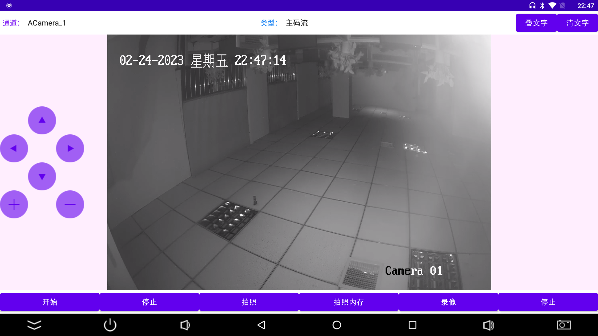

# 海康威视Android studio版 直接代码中改变参数就可以是使用 

根据官方最新SDK写的该demo，封装核心功能  
kotlin语言实现  
官方SDK下载地址：https://open.hikvision.com/download/5cda567cf47ae80dd41a54b3?type=10  

1.更新libs到海康威视最新版202212  
2.更新AndroidStudio到2022.1.1   
3.更新gradle到7.6  
4.升级到安卓13  
5.升级到Androidx  
6.升级到java11  
7.优化部分代码结构  
8.添加可控子码流变量  
9.多路播放支持  
  
## 开发环境准备
**推荐使用jetBrains Toolbox 中的android studio，并更新到最新正式版**  


### 在releases中有APK可以下载： [点击跳转](https://github.com/yutils/HikVisionDemo_2023/releases)
# 界面截图

  

集成使用
```kotlin
var hkCamera = HKCamera(binding.surfaceView).apply {
    devName = "余静的摄像头"
    ip = "192.168.1.70"
    port = "8000"
    username = "admin"
    password = "pw&123456"
}
//初始化，包含登录
hkCamera.init()

//开始预览（播放）
hkCamera.start()
//停止
hkCamera.stop()
//拍照，存盘
hkCamera.snap(path)
//开始录制视频
hkCamera.recordStart(path)
//停止录制视频
hkCamera.recordStop()
//拍照，获取bitmap
hkCamera.takePicture()
//叠加文字到视频
hkCamera.showString("你好，我是余静！")
```
